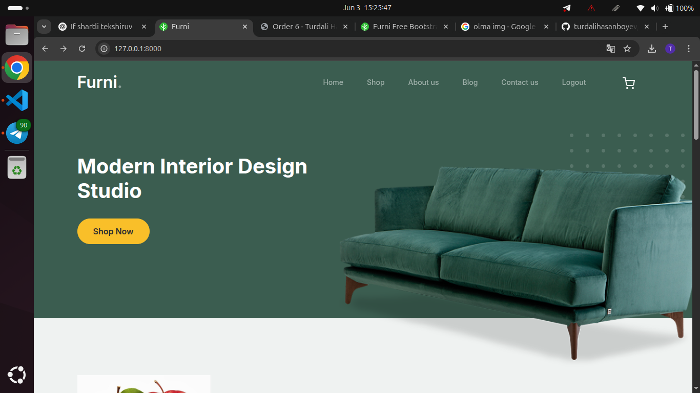

# 🏋️ Furni – Django E-commerce Furniture Store

Furni is a modern, responsive e-commerce web application built with Django, tailored for selling furniture online. It offers a seamless shopping experience with features like user authentication, product browsing, cart management, and order processing.

---

## 🧰 Tech Stack

* **Backend:** Django 5.2
* **Frontend:** HTML5, CSS3, JavaScript
* **Database:** SQLite (default), PostgreSQL (optional)
* **Other:** Bootstrap 5, Django Framework

---

## 🚀 Features

* User Registration & Authentication
* Product Catalog with Categories
* Shopping Cart Functionality
* Order Placement & Management
* Admin Dashboard for Product & Order Management
* Responsive Design for Mobile & Desktop

---

## 📦 Installation

1. **Clone the Repository:**

   ```bash
   git clone https://github.com/turdalihasanboyev/furni.git
   cd furni
   ```

2. **Create a Virtual Environment:**

   ```bash
   python -m venv env
   source env/bin/activate  # On Windows: env\Scripts\activate
   ```

3. **Install Dependencies:**

   ```bash
   pip install -r requirements.txt
   ```

4. **Configure Environment Variables:**

   Rename `.env.example` to `.env` and update the necessary configurations.

5. **Apply Migrations:**

   ```bash
   python manage.py makemigrations
   python manage.py migrate
   ```

6. **Create a Superuser:**

   ```bash
   python manage.py createsuperuser
   ```

7. **Run the Development Server:**

   ```bash
   python manage.py runserver
   ```

   Access the application at `http://127.0.0.1:8000/`.

---

## 🖼️ Screenshots

### 🏠 Home Page



### 🛒 Checkout Page


---

## 📁 Project Structure

```bash
furni/
├── apps/
│   ├── cart/
│   ├── order/
│   ├── product/
│   └── user/
├── config/
├── static/
├── templates/
├── manage.py
├── requirements.txt
└── .env.example
```

---

## 🤝 Contributing

Contributions are welcome! Please fork the repository and submit a pull request for any enhancements or bug fixes.

---

## 📄 License

This project is licensed under the [MIT License](LICENSE).

---

## 📬 Contact

For any inquiries or feedback, please contact [Turdali Hasanboyev](https://github.com/turdalihasanboyev/).
